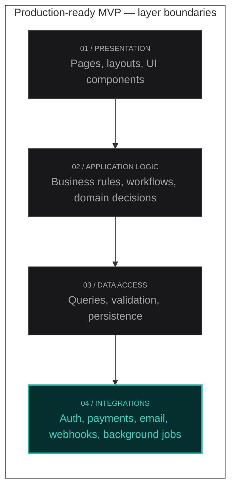

# The Anatomy of a Production-Ready MVP

Building an MVP is not about writing bad code quickly.

It's also not about building a miniature enterprise platform before you've talked to a single customer.

Most teams swing between those two extremes. They either ship something fragile that breaks the first time real traffic arrives, or they spend three months designing abstractions for problems they don't have yet.

A production-ready MVP sits in the middle.

It's the smallest system you can trust with real users, real payments, and real data—without pretending you already know what the product will become in twelve months.


After shipping several MVPs on tight timelines, I've found that the difference rarely comes down to how many features you launch. It comes down to whether the foundation can survive contact with reality.

When I built [DocPilot](/case-studies/docpilot), the temptation was to ship every documentation feature I could imagine—collaboration, version history, a full admin panel. I deferred almost all of it. The core loop was generate a document, save it, and retrieve it reliably. Managed auth, a typed API boundary, and basic error logging went in on week one. The fancy stuff waited until the product had paying users. That discipline is what got the product to validated revenue in four weeks instead of four months of foundation repair.

## Production-ready is not the same as feature-complete

The phrase "production-ready" makes people nervous because it sounds expensive.

It doesn't mean you need multi-region failover, a dedicated DevOps team, or a custom design system with forty components.

It means a few specific things:

- A user can complete the core workflow without hitting a dead end.
- Errors are handled gracefully instead of silently failing.
- You can deploy a fix without fearing you'll take the whole product offline.
- You have enough visibility to know when something breaks.

> If your MVP can't do those four things, you're not validating a product—you're stress-testing your ability to debug at 11 PM.

That's it.

### Where to invest (and where to wait)

| Area              | Ship fast              | Production-ready MVP                               | Too early                                               |
| ----------------- | ---------------------- | -------------------------------------------------- | ------------------------------------------------------- |
| **Auth**          | Skip or hardcode       | Managed provider (Clerk, Auth.js)                  | Custom IAM platform                                     |
| **Data model**    | Whatever works today   | Intentional schema for core entities               | Perfect normalized design for features that don't exist |
| **Observability** | `console.log`          | Error tracking + structured logs on critical paths | Full APM, custom dashboards                             |
| **Architecture**  | Everything in one file | Clear layer boundaries                             | Microservices, event buses                              |
| **Deployment**    | Manual FTP uploads     | Preview deploys + versioned migrations             | Multi-region failover                                   |
| **Features**      | Ten half-built flows   | One loop, end to end                               | Admin panels nobody asked for                           |

The middle column is not the most impressive option. It's the one that lets you learn from real users without gambling your launch night.

## Start with one loop, not ten features

Every production-ready MVP I've shipped started with a single question:

**What is the one action a user must be able to complete?**

For a documentation tool, it might be generating and saving a document.

For an outreach product, it might be sending a campaign and seeing whether it was delivered.

For a SaaS dashboard, it might be connecting an integration and viewing the first result.

Everything else is secondary.

Not unimportant—just secondary.

When you define that loop clearly, architecture decisions become easier. You know what must be reliable on day one and what can remain a manual process behind the scenes. You know which screens need polish and which can be functional placeholders.

The goal isn't to build less.

It's to build the right thing first.

## Architecture should reduce future cost, not prove expertise

I've watched early-stage teams introduce microservices, event buses, and custom infrastructure because they wanted the codebase to look "serious."

It almost always slows them down.

A production-ready MVP on Next.js doesn't need distributed complexity. It needs clear boundaries.

> Authentication shouldn't know how emails are sent. Billing shouldn't live inside a React component. Business logic shouldn't be scattered across API routes, server actions, and client-side hooks with no shared source of truth.

You don't need a complex folder structure. You need predictable places for things to live.

When I architect an MVP, I usually think in layers:

- **Presentation** — pages, layouts, and UI components.
- **Application logic** — the rules that define what the product actually does.
- **Data access** — how information is read, written, and validated.
- **Integrations** — third-party APIs, webhooks, and background work.



That separation is enough for most products to scale well past early revenue. You can extract services later if traffic demands it. You rarely need to do it on week one.

A typical Next.js MVP folder shape looks like this:

```ini
app/
  (marketing)/
  (dashboard)/
  api/
lib/
  db/
  validations/
  services/
components/
```

Nothing clever. Just places where things belong.

## Type safety is a production feature

This is the part people underestimate.

TypeScript isn't about satisfying the compiler. It's about making change cheaper.

When you're moving fast, requirements shift constantly. A field gets renamed. A workflow adds a new state. An integration returns a slightly different payload.

Without types, those changes propagate silently until something breaks in production.

With types, the codebase tells you where you need to update.

On a Next.js MVP, I treat types as contracts between layers:

- Shared types for domain models.
- Validated input schemas at API boundaries.
- Explicit return types for anything that crosses the client-server line.

You don't need perfect coverage on day one. You need coverage on the paths that matter—the core loop, authentication, payments, and anything that touches external systems.

That's usually where bugs are most expensive.

Here's a pattern I reach for on almost every MVP—a Zod schema at the boundary, shared between client and server:

```typescript
// lib/validations/document.ts
import { z } from "zod";

export const createDocumentSchema = z.object({
  title: z.string().min(1).max(120),
  content: z.string().min(1),
  projectId: z.string().uuid(),
});

export type CreateDocumentInput = z.infer<typeof createDocumentSchema>;
```

```typescript
// app/api/documents/route.ts
import { createDocumentSchema } from "@/lib/validations/document";
import { createDocument } from "@/lib/services/documents";

export async function POST(request: Request) {
  const body = await request.json();
  const parsed = createDocumentSchema.safeParse(body);

  if (!parsed.success) {
    return Response.json(
      { error: "Invalid input", issues: parsed.error.flatten() },
      { status: 400 }
    );
  }

  const document = await createDocument(parsed.data);
  return Response.json(document, { status: 201 });
}
```

The schema is the contract. Change a field once, and TypeScript shows you every callsite that needs updating. That's production-ready thinking—not enterprise overhead.

## Auth and data: minimum scope, maximum discipline

Production-ready doesn't mean building a full identity platform.

It means not improvising security.

For most MVPs, a managed auth provider is the right call. Rolling your own session handling is rarely where you create competitive advantage. Getting it wrong is where you create liability.

The same principle applies to data.

You don't need a perfect schema on launch. You do need intentional decisions:

- What is the source of truth for each entity?
- What happens when a write fails halfway through?
- Which fields are required for the core loop to function?
- What data would be painful or impossible to migrate later?

I've seen MVPs fail not because the database was too simple, but because nobody thought about how records related to each other until the product was already live.

A small amount of upfront modeling saves weeks of retrofitting.

## Errors, logging, and the things users never see

Users don't judge an MVP by your internal tooling.

They judge it by what happens when something goes wrong.

A production-ready MVP handles failure deliberately:

- Form errors are specific and recoverable.
- API failures return useful messages instead of generic 500s.
- Background jobs retry or surface failures instead of disappearing.
- Critical paths have basic logging so you can answer "what happened?" without guessing.

You don't need a full observability stack. You need enough signal to debug real issues quickly.

When I deploy an MVP, I want to know:

- Did the deployment succeed?
- Are requests failing at an unusual rate?
- Are external integrations timing out?
- Is anyone stuck in an error state they can't escape?

That level of visibility is cheap to add early and expensive to add later.

## Deployment should be boring

Velocity dies when deployments are scary.

A production-ready MVP has a repeatable path from code to production:

- Environment variables are documented and separated by environment.
- Database migrations are versioned, not applied manually in a panic.
- Preview deployments exist for anything non-trivial.
- Rollbacks are possible without heroic effort.

On Next.js, this often means leaning on the platform rather than building custom deployment pipelines. Vercel, managed Postgres, and a few well-chosen third-party services can carry you surprisingly far.

The point isn't to avoid infrastructure decisions forever.

It's to avoid making irreversible ones before you have users.

## What to deliberately not build

Knowing what to skip is as important as knowing what to include.

On most MVPs, I defer:

- Admin dashboards with twenty settings nobody has asked for.
- Complex role-based permissions beyond what the launch actually needs.
- Custom analytics when product analytics tools exist.
- Performance optimizations for traffic you don't have.
- Abstractions for features that haven't been validated.

Each of those can be added when there's evidence they're needed.

> What you can't easily add later is trust. If the core loop is flaky, if data integrity is uncertain, or if every deploy feels risky, you'll spend your runway fixing foundations instead of learning from users.

## The anatomy, in practice

When I look at a production-ready MVP, I don't see a long feature list.

I see a system with a clear shape:

1. **One core workflow** that works end to end.
2. **Clear boundaries** between UI, logic, and data.
3. **Typed contracts** at the places where change is most likely.
4. **Managed auth and intentional data modeling** where mistakes are costly.
5. **Basic error handling and observability** so failures are visible.
6. **A boring deployment process** that doesn't block iteration.

That's the anatomy.

Not maximum features. Not maximum complexity.

Just enough structure to move fast without breaking the things that matter.

### Before you launch

- [ ] Core loop works end to end in production (not just locally)
- [ ] Auth protects every route and API that needs it
- [ ] Input validated at boundaries with typed schemas
- [ ] Errors are visible to you—not just swallowed in a `catch`
- [ ] One deployment dry run and rollback tested
- [ ] You can answer "what broke?" without guessing

Because the goal of an MVP isn't to impress other engineers with your architecture.

It's to put something real in front of users—and still be able to sleep the night you launch.
