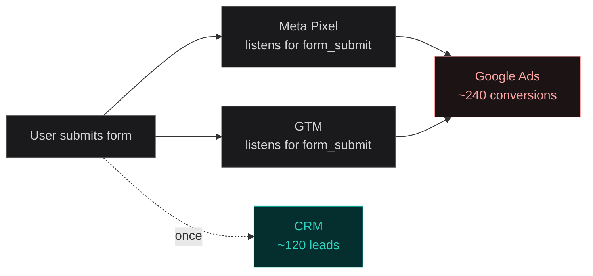
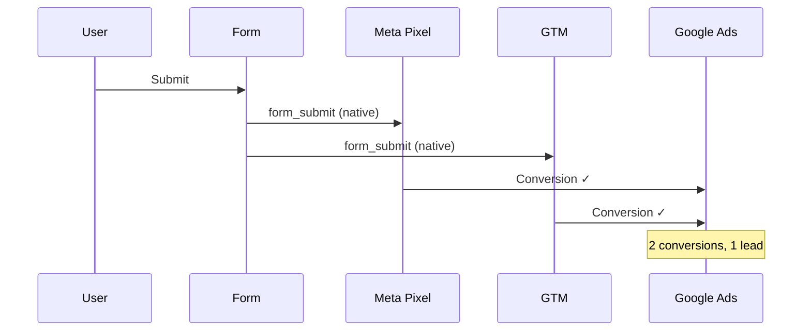

A client came to us with a number that didn't make sense.

Google Ads: **~240 conversions** last month.
CRM: **~120 leads**.
Same campaign. Same form. Same time window.

Not roughly off. Almost exactly **2x**, day over day, for weeks.

> A conversion number that looks too good is more urgent to investigate than one that looks too bad. Underperformance gets questioned immediately. Overperformance gets celebrated—and the wrong number compounds.

This is the postmortem: how we found it, why it happened, and the pattern worth checking before you trust any conversion dashboard.

## The symptom

Every source of truth disagreed with Google Ads—except Google Ads agreed with itself.

| Source              | Monthly count | Notes                         |
| ------------------- | ------------- | ----------------------------- |
| Google Ads          | ~240          | "Campaign is crushing it"     |
| GA4 Key Events      | ~235          | Same ballpark                 |
| CRM                 | ~120          | Actual leads in the pipeline  |
| Form endpoint logs  | ~120          | Server-side ground truth      |
| Email notifications | ~120          | One email per real submission |

The leads were real. Nobody was spamming the form. They were just being **counted twice**.



## Hypothesis #1: bot traffic (ruled out in an hour)

First instinct: spam submissions or bot traffic inflating the count.

We pulled IP and user-agent data on a sample of the "extra" conversions. No suspicious patterns—no shared IPs, no headless browser signatures, no geographic weirdness.

The duplicate events were firing from the **same session** as the legitimate one. Often within **milliseconds**.

That ruled out bots and pointed straight at the tracking layer.

## Root cause: two listeners, one event

Both the Meta Pixel and GTM were listening for the browser's native `form_submit` event.

One click. Two conversion pings.



Neither tool was misconfigured in isolation. Each was doing exactly what `form_submit` tracking is supposed to do. The problem was **two separate systems independently watching the same generic event**—and each treating their own detection as a conversion.

This is easy to miss because nothing throws an error:

- Page loads fine
- Form works fine
- Each tool does what it's configured to do
- The bug only shows up downstream, in aggregate numbers

It survived multiple rounds of QA because nobody was watching the wire—only the dashboard.

### How we confirmed it

GTM Preview mode + Meta Events Manager test tool. One live test submission.

Both fired. Seconds apart. Same form, same click.

Confirmed in under ten minutes once we knew to look. Invisible from the Ads or GA4 interface alone—both systems were agreeing with each other, and both were wrong.

## Bonus find: the gclid trap

While we were in the container, we found a related issue—not duplication, but **under-counting in disguise**.

GA4 Key Events were configured to count conversions only when the session carried a `gclid` (Google's click ID for ad traffic). Standard setup. Works fine for same-session conversions.

Doesn't work for this buyer pattern:

1. User clicks ad → lands on site → doesn't convert
2. Two days later → bookmarks the site or searches the brand name
3. User converts → **no gclid on session 2** → not counted

The client thought they were "losing" conversions. Really, it was a measurement design choice that didn't match how people actually buy.

| Problem          | Symptom                             | Fix                                           |
| ---------------- | ----------------------------------- | --------------------------------------------- |
| Double-counting  | Numbers ~2x too high                | Custom event, single source of truth          |
| gclid dependency | "Lost" conversions on return visits | Extended attribution window + CRM cross-check |

## The fix

### Stop listening to `form_submit`

Generic browser events are convenient because anything can listen for them. That's also what makes them dangerous once more than one tool does.

We replaced `form_submit` with a custom event fired **only after confirmed success**—validation passed, server returned 200:

```javascript
// After successful form submission
window.dataLayer = window.dataLayer || [];
window.dataLayer.push({
  event: "lead_form_success",
  form_id: "contact",
});
```

Both Pixel and GTM now listen for `lead_form_success` instead of the native browser event. Double-count stopped immediately.

### Rebuild, don't patch

Auditing how `form_submit` had been wired surfaced enough other cruft—leftover tags, conflicting triggers from earlier iterations—that a patch wasn't enough. We rebuilt from a fresh GTM container with everything set up deliberately, rather than carrying forward years of incremental edits.

For the gclid issue: extended the lookback window in GA4 attribution settings and cross-referenced "lost" conversions against CRM data. Most weren't lost. They were attributed to a later, non-ad session.

## The diagnostic checklist

If your conversion numbers look suspiciously good, run this before reallocating budget:

- [ ] Open GTM Preview + the other tool's test mode side by side
- [ ] Submit one test conversion and watch network requests in DevTools
- [ ] Count how many conversion pings fire per submission (should be **1**)
- [ ] Cross-reference against server logs or CRM—not another analytics tool
- [ ] Check whether multiple tools listen for the same generic event (`form_submit`, `click`, page load)

> The diagnostic isn't "check the dashboard." It's "check the wire." Dashboards show you what was reported, not what was sent.

## What to take away

**One custom event > two generic listeners.** Fire deliberately, after the action you actually care about is confirmed. Worth the extra setup step.

**Two reporting systems agreeing doesn't mean they're right.** They can both be listening to the same broken signal.

**Treat tracking as code that can have bugs.** The platform's reported numbers aren't ground truth—they're an aggregation of whatever your tags actually sent.

The immediate fix took an afternoon. Rebuilding the container properly took longer, but the audit turned up enough accumulated mess to make it worth doing once. The bad data had been compounding for months before anyone asked why the numbers looked too clean.
