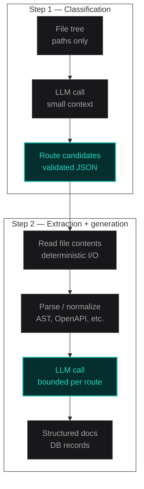

# Two-Step LLM Pipelines: Classification Before Generation

Don't ask the LLM to do parsing and reasoning in the same breath. It will confidently do both badly.

I learned this while building [DocPilot](/case-studies/docpilot), an automated API documentation tool that reads GitHub repos and generates structured docs. The first version tried to be clever: ingest the repo, guess which files mattered, feed everything into one big generation call, and ship whatever came back.

It worked on my test project. It fell apart on everyone else's.

Framework middleware showed up as endpoints. Config files became request handlers. Utility helpers got documented with HTTP status codes they never returned. The docs weren't wrong in a subtle way. They were confidently, structurally wrong.

The fix wasn't a better prompt. It was splitting the pipeline into two steps:

1. **Classification** — the LLM reads the file tree and returns route candidates.
2. **Extraction + generation** — deterministic code reads only those files, parses them, and builds the doc context.

That separation is the pattern I want to unpack here. Not because it's novel, ETL pipelines have done "filter then transform" forever, but because most AI product code I see still treats the model as a single omniscient function.


## The bug: path heuristics don't generalize

DocPilot's GitHub sync starts with a webhook on push to main. The handler walks the repo, collects file paths, and needs to answer one question before anything else:

**Which of these files actually define API routes?**

My first answer was heuristics:

```typescript
function looksLikeRouteFile(path: string): boolean {
  if (path.includes("node_modules")) return false;
  if (path.endsWith(".test.ts")) return false;
  if (path.includes("/api/")) return true;
  if (path.includes("routes/")) return true;
  if (path.match(/route\.(ts|js)$/)) return true;
  return false;
}
```

This works until it doesn't.

Next.js App Router puts routes in `app/api/.../route.ts`. Express apps use `routes/`. Some teams colocate handlers in `src/server/handlers/`. Others export route tables from a single `router.ts`. A monorepo might nest the API three directories deep under `packages/backend/src/`.

Heuristics encode _your_ mental model of "what a route file looks like." Users don't ship your mental model. They ship theirs.

Worse: false positives poison downstream generation. Once a middleware file enters the context window, the model doesn't shrug and skip it. It invents an endpoint around it. LLMs are completion engines. Give them a file that exports a function, and they will narrate an HTTP contract for it.

That's when I stopped trying to outsmart the file tree with regex and added a dedicated classification step.

## Step 1: classification with a tight contract

The classification step receives **only metadata**, file paths, maybe top-level directory names, not full file contents. The job is narrow: return a list of paths likely to define HTTP handlers.

```typescript
// lib/ai/classify-routes.ts
import { z } from "zod";

export const routeCandidateSchema = z.object({
  path: z.string(),
  confidence: z.enum(["high", "medium", "low"]),
  reason: z.string().max(200),
});

export const classificationResultSchema = z.object({
  candidates: z.array(routeCandidateSchema),
  frameworkHint: z.string().optional(),
});

export type ClassificationResult = z.infer<typeof classificationResultSchema>;
```

The prompt is deliberately boring:

> Given this repository file tree, identify files that likely define HTTP API route handlers. Return JSON matching the schema. Do not invent files that are not in the tree. Prefer precision over recall, it's better to miss a route than to include middleware, config, or test files.

**Input:** string array of paths (a few KB of tokens, even on large repos).

**Output:** validated JSON with candidates and short reasons.

This is where structured output earns its keep. You're not parsing free-form markdown hoping the model didn't add a preamble. You validate with Zod and reject or retry on schema failure.

```typescript
// lib/ai/classify-routes.ts
export async function classifyRouteFiles(
  filePaths: string[]
): Promise<ClassificationResult> {
  const tree = filePaths.join("\n");

  const response = await gemini.generateContent({
    model: "gemini-2.0-flash",
    contents: [
      { role: "user", parts: [{ text: buildClassificationPrompt(tree) }] },
    ],
    generationConfig: {
      responseMimeType: "application/json",
      responseSchema: classificationResultSchema,
    },
  });

  const parsed = classificationResultSchema.safeParse(
    JSON.parse(response.text)
  );

  if (!parsed.success) {
    throw new ClassificationError(
      "Model returned invalid schema",
      parsed.error
    );
  }

  return parsed.data;
}
```

Notice what's _not_ in this step: reading file contents, parsing TypeScript ASTs, generating user-facing documentation, or calling external APIs. Classification is a filtering problem. Keep it small.



## Step 2: deterministic extraction, then bounded generation

After classification, your code, not the model, owns I/O.

For each candidate path:

1. Fetch the file from GitHub (or local storage).
2. Parse it with deterministic tooling where possible (TypeScript compiler API, OpenAPI parser, regex for simple Express routers).
3. Build a **bounded context object** per route: method, path, params, return type hints, relevant types from imports.
4. Send _that_ to the generation model, not the raw file, not the whole repo.

```typescript
// lib/docs/generate-from-route.ts
export async function generateRouteDoc(
  candidate: RouteCandidate,
  source: string
): Promise<RouteDoc> {
  const extracted = extractRouteDefinition(source, candidate.path);

  if (!extracted) {
    // Classification was wrong, or file changed between steps. Skip, don't hallucinate
    return { skipped: true, path: candidate.path, reason: "no_handler_found" };
  }

  const doc = await gemini.generateContent({
    model: "gemini-2.0-flash",
    contents: [
      {
        role: "user",
        parts: [
          {
            text: buildGenerationPrompt({
              frameworkHint: candidate.reason,
              route: extracted,
            }),
          },
        ],
      },
    ],
    generationConfig: {
      responseMimeType: "application/json",
      responseSchema: routeDocSchema,
    },
  });

  return routeDocSchema.parse(JSON.parse(doc.text));
}
```

The generation prompt sees a structured object:

```json
{
  "method": "POST",
  "path": "/api/documents",
  "handler": "createDocument",
  "params": [{ "name": "title", "type": "string", "required": true }],
  "responseShape": "{ id: string, createdAt: string }"
}
```

Not forty unrelated files. Not `middleware.ts`. Not `drizzle.config.ts`.

That's the core insight: **the model's job in step 2 is narration and synthesis, not discovery.** Discovery already happened, or should have.

## Why one-shot breaks reproducibility

When you combine classification, parsing, and generation in a single prompt, three things go wrong:

**Context pollution.** Every irrelevant file competes for attention in the same window. Models don't ignore noise reliably, they incorporate it.

**Non-deterministic parsing.** Ask an LLM to "read this Express file and extract routes" and you'll get different extractions on different runs. Temperature isn't the only variable; phrasing drift in the source file matters too.

**Opaque failures.** When docs are wrong, you can't tell whether the model misread the file tree, misread a handler, or hallucinated during generation. Three failure modes, one black box.

Splitting the pipeline gives you a decision log:

| Step           | What failed                   | What you do                                                        |
| -------------- | ----------------------------- | ------------------------------------------------------------------ |
| Classification | Middleware labeled as route   | Tune prompt, add denylist patterns, require `high` confidence only |
| Extraction     | File had no parseable handler | Skip file; optionally downgrade classifier prompt                  |
| Generation     | Schema validation failed      | Retry with stricter prompt or smaller context                      |

You can't get that table from a one-shot prompt.

## Cost and latency: small first, big second

One-shot feels cheaper because it's one API call. It usually isn't.

Consider a repo with 400 files, 12 of which are actual routes. Average route file: 80 lines (~3K tokens). Irrelevant files you mistakenly include: 50 files at ~2K tokens each.

**One-shot (naive):** feed 50 files × 2K + overhead ≈ 100K+ input tokens per generation run. Output is a monolithic doc blob that's expensive to validate and expensive to fix partially.

**Two-step:**

| Step                                     | Input tokens (approx.) | Output tokens (approx.) |
| ---------------------------------------- | ---------------------- | ----------------------- |
| Classification (file tree only)          | 2–8K                   | ~500                    |
| Generation (12 routes × bounded context) | 12 × 1–2K = 12–24K     | 12 × 800 = ~10K         |

Total input drops sharply because you never read file contents for the 388 files that aren't routes. Classification adds one cheap call. Generation runs in parallel per route if your infra allows it.

Latency follows the same shape. Classification returns in seconds. Per-route generation fans out. A one-shot call on a large context window sits on the slow tail of provider throughput.

For [DocPilot](/case-studies/docpilot), I chose Gemini largely on cost at volume. The two-step split is what made that choice viable. Without it, token burn on noisy repos would have eaten the margin.

## Failure handling when classification is wrong

Classification will mislabel files. The question is whether mislabels corrupt your output.

I use three guardrails:

### 1. Precision over recall in the classifier prompt

Missing a route is annoying. Documenting `lib/auth/middleware.ts` as `POST /api/users` is worse. Users lose trust faster from false docs than from incomplete docs.

Default to `high` confidence candidates only for automatic generation. Surface `medium` and `low` in a review queue if you build that later.

### 2. Extraction as a veto gate

If deterministic extraction can't find a handler in the file, **skip generation**. Don't ask the model to guess what the file "probably" does.

```typescript
const extracted = extractRouteDefinition(source, candidate.path);

if (!extracted) {
  logger.info("classification_miss", {
    path: candidate.path,
    confidence: candidate.confidence,
  });
  return { skipped: true, path: candidate.path, reason: "no_handler_found" };
}
```

This is your free error-correction layer. Classifier false positives die here without ever reaching user-facing docs.

### 3. Denylist patterns as a safety net

Even with AI classification, keep hard excludes for paths you know are never routes:

```typescript
const NEVER_ROUTE = [
  /node_modules/,
  /\.test\.(ts|js|tsx|jsx)$/,
  /\.config\.(ts|js|mjs|cjs)$/,
  /middleware\.(ts|js)$/,
  /drizzle\//,
  /\.d\.ts$/,
];

function isHardExcluded(path: string): boolean {
  return NEVER_ROUTE.some((pattern) => pattern.test(path));
}
```

Heuristics aren't useless, they're just not sufficient alone. Use them as guardrails, not as the primary classifier.

## When to use this pattern (and when not to)

**Use two-step when:**

- You're selecting a subset of inputs from a large corpus (files, emails, tickets, log lines).
- Downstream work is expensive per item (long generation, external API calls, human review).
- Deterministic parsers exist for the content but discovery doesn't (which files, which records, which threads).
- Wrong inclusion is costlier than wrong exclusion.

**Skip it when:**

- The input is already small and structured (a single OpenAPI spec, one PDF, one JSON payload).
- You have a reliable deterministic filter (file extension is always `.openapi.yaml`).
- The task is genuinely single-shot creative work with no selection step.

DocPilot's file upload path is mostly single-step: OpenAPI and PDF inputs go through deterministic parsers first, then generation. The two-step pattern mattered for GitHub sync, where the file tree is the hard part.

## The shape of the pipeline in production

Wiring this into a webhook handler looks roughly like this:

```typescript
// app/api/webhooks/github/route.ts
export async function POST(request: Request) {
  const event = await verifyGitHubWebhook(request);
  if (event.ref !== "refs/heads/main") {
    return Response.json({ ok: true, skipped: "not_main" });
  }

  const filePaths = await listRepoPaths(event.repository.full_name);
  const eligible = filePaths.filter((p) => !isHardExcluded(p));

  const classification = await classifyRouteFiles(eligible);
  const routes = classification.candidates.filter(
    (c) => c.confidence === "high"
  );

  const sources = await fetchFiles(
    event.repository.full_name,
    routes.map((r) => r.path)
  );

  const docs = await Promise.all(
    routes.map(async (candidate) => {
      const source = sources.get(candidate.path);
      if (!source) return null;
      return generateRouteDoc(candidate, source);
    })
  );

  const saved = docs.filter(
    (d): d is RouteDoc => d !== null && !("skipped" in d && d.skipped)
  );

  await persistDocs(event.installation.id, saved);

  return Response.json({
    ok: true,
    classified: routes.length,
    generated: saved.length,
  });
}
```

## What I'd still improve

The current DocPilot implementation regenerates all docs on every push to main. The two-step split makes **incremental** regen possible: diff changed paths, re-classify only if the tree structure changed, re-extract only touched route files. That's the next optimization, not a rethink of the pipeline shape.

If you're building something that reads variable codebases, document corpora, or ticket backlogs with an LLM, start by asking:

**What's the cheapest step that reduces the input set before the expensive step runs?**

Usually that's classification. And usually it shouldn't be the same call that writes the final output.

---

**Related:** [DocPilot case study](/case-studies/docpilot) · [The Anatomy of a Production-Ready MVP](/blog/anatomy-of-mvp)
