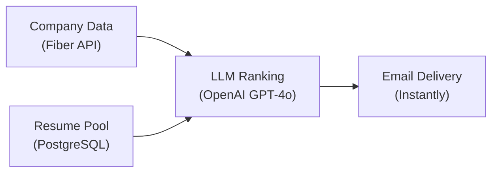

## The Context

The product is a global hiring platform that helps early-stage startups fill engineering roles with talent from India and Latin America. Inbound leads worked, but outbound was still fully manual — recruiters hunting founders on LinkedIn, matching candidates by hand, and writing cold emails one at a time.

I owned the feature end to end: design the pipeline, wire it into the existing Next.js app, and ship it to production in six weeks. The goal wasn't a standalone cold email tool. It was a matching pipeline with email as the output layer — discover the right founders, rank candidates from the resume pool, personalize outreach to whatever signal existed, and let ops flip it on or off from the dashboard.

No new microservices, no greenfield repo — just a type-safe feature built into the codebase the team was already running on Trigger.dev and PostgreSQL.

---

## The Problem

The real leverage in hiring outreach is **proactive matching**: find founders at companies already hiring remotely from target regions, pair them with candidates from the resume pool, and send something that feels specific — not spray-and-pray.

The manual workflow didn't scale:

1. Recruiter finds a YC company that just hired a remote engineer
2. Checks for an open role, picks a candidate, writes a cold email
3. Repeats five times a day

The platform needed discovery, matching, and delivery automated — while keeping humans in control of when the system runs.

This is the same class of problem I write about in [The Anatomy of a Production-Ready MVP](/blog/anatomy-of-mvp): one core loop, end to end, with enough structure to trust in production.

---

## What I Delivered

- **Scheduled orchestration** — a Trigger.dev cron (every 12 hours) that runs discovery → ranking → outreach without manual intervention
- **Intelligent targeting** — company search filtered by funding stage, size, and a custom signal: recent remote hires from target regions
- **Dual ranking paths** — GPT-4o structured output against job descriptions _or_ existing team profiles when no job post is indexed
- **Personalized campaigns** — Instantly integration with per-lead template variables and separate sequences by context
- **Ops control surface** — dashboard toggle to activate/deactivate the schedule via API, no redeploy required
- **Dedup infrastructure** — Fiber exclusion lists so the same founder never gets emailed twice

---

## Architecture

The pipeline is four layers wired through a single orchestrator:



| Layer         | Responsibility                                                                 |
| ------------- | ------------------------------------------------------------------------------ |
| **Discovery** | Find ~5 target companies per run, enrich with jobs, founders, and recent hires |
| **Matching**  | Batch-rank every applicant in parallel, pick the top match per company         |
| **Outreach**  | Create and activate Instantly campaigns with context-specific copy             |
| **Control**   | Dashboard toggle + Trigger.dev schedule management                             |

Each enrichment step is fault-tolerant. Missing job posts or founder emails don't crash the run — they change which ranking mode and email template fire downstream.

---

## Engineering Highlights

### Signal over volume

Five companies per run, not five hundred. Each one gets full enrichment, full LLM ranking, and a personalized email. I optimized for targeting quality, not inbox flooding.

The key filter: companies that **recently hired** at least one engineer from India or LATAM in the last six months. That signal means they're already comfortable with remote hiring from target regions — warm before the first email lands.

### Two ranking paths, one orchestrator

Not every company has a public job post. I built two modes chosen at runtime:

**Mode A** — rank against the job description when title and description exist.

**Mode B** — rank against recent employee profiles when they don't. The LLM scores how well a candidate fits the team the company already has.

```typescript
// src/trigger/outbound.ts — runtime ranking strategy
if (hasJobData) {
  batchResult = await outboundRankApplicantTask.batchTriggerAndWait(
    applicants.map((applicant) => ({
      payload: {
        applicantId: applicant.id,
        jobDescription: jobDescription!,
        jobTitle: jobTitle!,
      },
    }))
  );
} else if (employees.length > 0) {
  batchResult = await outboundRankApplicantByEmployeesTask.batchTriggerAndWait(
    applicants.map((applicant) => ({
      payload: {
        applicantId: applicant.id,
        employees,
        companyName,
      },
    }))
  );
}
```

This turned "no job post, skip this company" into a viable angle: _"Here's a candidate similar to [Engineer You Just Hired]."_

### Graceful degradation as a feature

No job post? Rank against employees. No founder email? Skip silently. No applicants in the pool? Exit early. The cron never crashes on partial data — it just produces less output.

Dedup is baked into the discovery step, not bolted on later:

```typescript
// src/trigger/outbound.ts — exclusion list after each run
await fiberRequest("/exclusions/companies/add-to-list", {
  listId: process.env.FIBER_EXCLUSION_LISTID,
  companies: companies
    .map((company) => ({ domain: company.domains?.[0] }))
    .filter((c): c is { domain: string } => !!c.domain),
});
```

Without this, a twice-daily cron would eventually spam the same founders.

### Batch parallelism for LLM calls

Ranking N applicants × M companies sequentially would be too slow. Trigger.dev's `batchTriggerAndWait` fans out ranking tasks and waits for all of them — the orchestrator stays simple while compute scales.

The scheduled entry point:

```typescript
// src/trigger/outbound.ts
export const outboundEngine = schedules.task({
  id: "outbound-engine",
  cron: { pattern: "0 */12 * * *" },
  run: async () => {
    const companies = await companyData();
    const applicants = await loadApplicantPool();

    for (const company of companies) {
      // enrich → rank → queue lead
    }

    await activateInstantlyCampaigns(leads);
  },
});
```

---

## Stack Choices

| Component      | Choice               | Why                                                                        |
| -------------- | -------------------- | -------------------------------------------------------------------------- |
| App shell      | Next.js + TypeScript | Feature integrated into existing dashboard, API routes, and typed boundaries |
| Orchestration  | Trigger.dev v3       | Cron schedules, parallel batch tasks, retries, observability               |
| Resume pool    | PostgreSQL           | Shared candidate pool with PDF text extracted once, reused across rankings |
| Company data   | Fiber API            | Structured company/people/job search + email enrichment                    |
| Matching       | OpenAI GPT-4o        | Structured output with explainable match scores                            |
| Email delivery | Instantly API        | Campaign creation, lead injection, send scheduling                         |

Same philosophy as [DocPilot](/case-studies/docpilot): pick managed services and clear layer boundaries over custom infra you don't need on week one.

---

## In Practice

Every 12 hours (when enabled), the pipeline:

- Discovers ~5 US startups showing remote hiring intent from target regions
- Enriches each with jobs, founders, emails, and team profiles
- Ranks the entire resume pool against each company in parallel
- Emails founders with a link to the best-matched candidate
- Marks those companies as contacted so they never re-enter the funnel

A recruiter uploads resumes to the pool. The automation handles the rest.

---

## Why This Matters for Founders

Most early-stage teams treat outbound as a manual ops problem or over-engineer it into a distributed system before they've validated the loop.

This is what I mean when I say **MVP velocity and outbound automation systems** on my homepage: take a messy workflow inside an existing product, translate it into reliable software in weeks, and ship it with production-ready boundaries — typed APIs, fault-tolerant jobs, ops controls — without enterprise bloat.

If you're building a SaaS product where automation is the moat — matching, outreach, enrichment pipelines, background jobs at scale — this is the kind of feature work I take on.

---

**Related:** [DocPilot case study](/case-studies/docpilot) · [The Anatomy of a Production-Ready MVP](/blog/anatomy-of-mvp)
