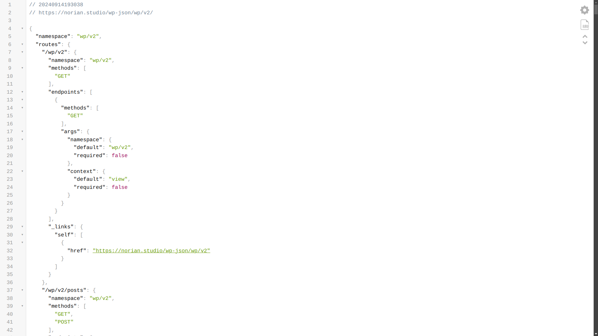

I've had the honor to talk about this topic in [WordCamp Nagpur 2024](https://nagpur.wordcamp.org/2024/jamstack-meets-wordpress-anindo-neel-dutta-to-lead-advanced-workshop-at-wordcamp-nagpur-2024/). This post is pretty much an excerpt of my session.

WordPress is a content-management system that uses a traditional templating system to render content to the users. WordPress uses a query string to find the content from the backend and display it on the frontend using template files.

## Dynamic Rendering

Blocks with dynamic rendering generate their content and structure in real-time when requested on the front end. This is suitable for content that needs to be updated frequently or is dependent on external data.

## Server-Side Rendering (SSR)

SSR is a rendering pattern that delivers dynamic content for WordPress. SSR works by connecting to the database to fetch blog posts, determining the template to use based on the page, running any filters and callbacks, and responding with the full HTML string. SSR offers a balance of flexibility, simplicity, and performance, but it has some tradeoffs. For example, the server has to do a lot of work without optimizations or caching, and SSR doesn't scale well when many users are hitting the website.

## What is JAMstack?

Jamstack is a modern web development architecture designed to create fast, secure and scalable websites and applications. The term "JAMstack" stands for JavaScript, APIs and Markup.

### JavaScript:

The dynamic functionality of the site is handled by JavaScript, running in the browser. This can range from simple interactions to complex applications, with the logic executed on the client side.

### APIs:

Server-side operations are abstracted into reusable APIs, which are accessed over HTTP with JavaScript. These APIs can be third-party services (like payment gateways or content management systems) or custom-built serverless functions.

### Markup:

The core content and layout of the site are pre-built as static HTML files, which can be generated by static site generators (SSGs) like Next.js, Gatsby, or Hugo. These static files are then served to users, providing a fast and efficient browsing experience.

---

## Step 1: Looking into the REST API

Now that we've got ourselves acquainted with Headless WordPress and Jamstack, we'll delve a bit deeper into how to bring these two together.

You see, the way we make these two layers talk is using APIs. You can either use WordPress' REST API or you can use [WPGraphQL](https://wordpress.org/plugins/wp-graphql/) to expose a GraphQL API from your site. But, we'll keep things simple today and use REST APIs.

Now, go ahead and pick a WordPress site of your choice. We'll use [Norian Games](https://norian.studio/) for this example. We can access its REST API by going to the `wp-json/wp/v2/` route. So, the URL we'd visit will be https://norian.studio/wp-json/wp/v2/. Try opening the URL in your browser.



Awesome! You've completed the first step towards decoupling your WordPress site!

## Step 2: Initializing Our project

We're going to use [Astro](https://astro.build/) for this example, though you're free to use any static site generators you want. However, keep in mind that the process will be different.

Go ahead and run `npm create astro@latest` on the terminal. It'll scaffold a sample project for us to start building our site in!

## Step 3: Talking to the API

This step is pretty straight forward. We'll send a `fetch()` request to our API's `/posts` route to get the posts.

```astro
---
const data = await fetch("https://norian.studio/wp-json/wp/v2/")
const posts = await posts.json()
---

<pre>
  {JSON.stringify(posts, null, 2)}
</pre>
```

This will show us a JSON response comprising of the posts on our browser.
